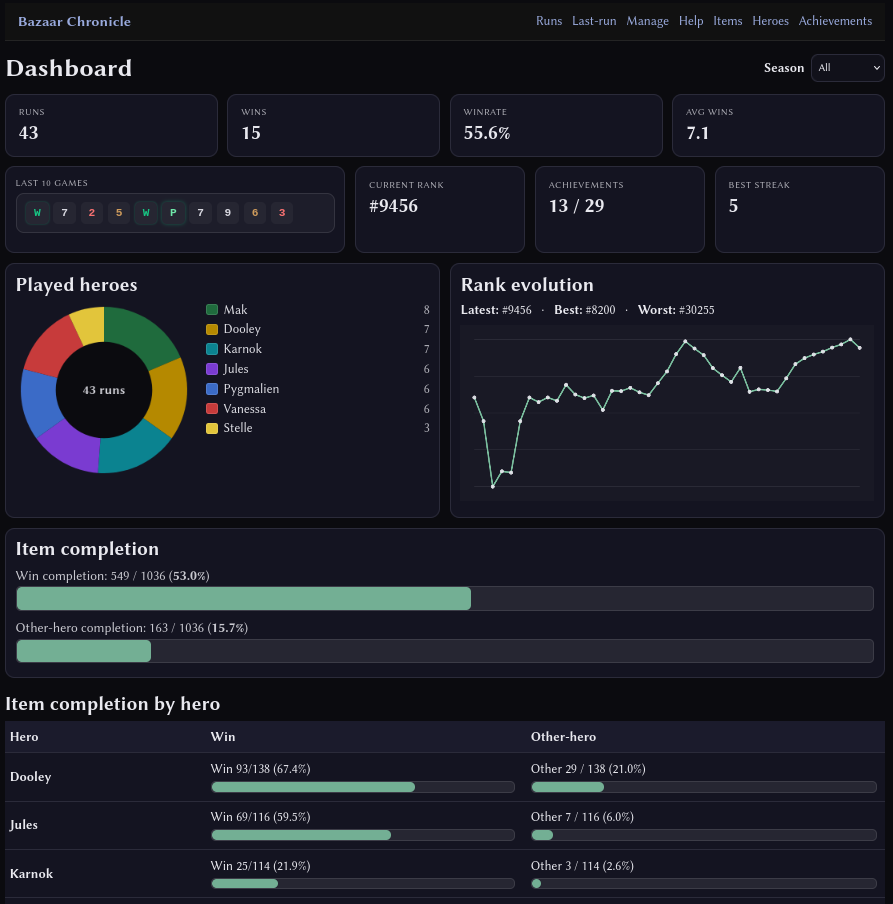
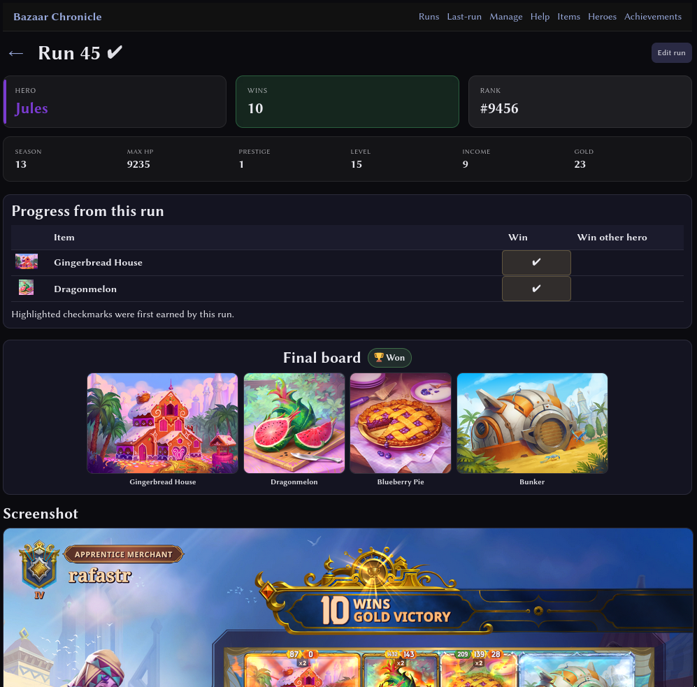
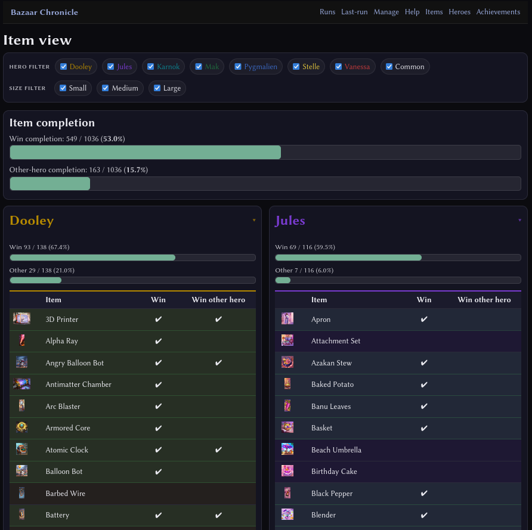
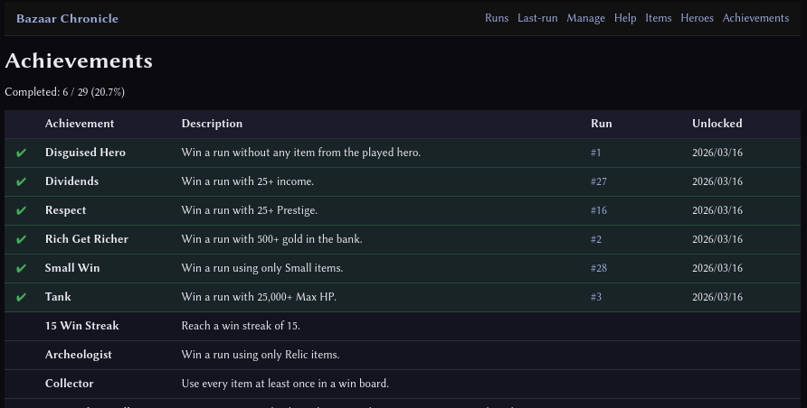

# Bazaar Chronicle
Bazaar Chronicle is a local run tracker for [**The Bazaar**](https://playthebazaar.com/).

It records your runs, analyzes performance, and tracks achievements and item mastery.

The application runs locally on your machine as a small web app and opens in your browser.
- No accounts
- No cloud services
- All data stays on your computer.

---

## Features

### Run tracking
- Automatic run detection from game logs
- Screenshot capture at run end
- Manual run creation and editing
- OCR support for extracting run data

### Board tracking
- Record final board items
- Board editor

### Statistics dashboard
- Rank evolution graph
- Win/loss history
- Hero performance stats

### Achievements
- Achievement system based on run performance
- 25+ achievements to unlock

### Item mastery
Track progress toward:
- Using every item in a winning run
- Using items with different heroes in a winning run
- Import item checklist from external CSV

### Fully local
- SQLite database
- Local image cache
- Works offline
- Export/import your data

---

Dashboard
## Dashboard



## Run details



## Items



## Achievements



---

## Download and Run
Download the latest release from GitHub Releases.

Extract the archive and run:
`BazaarChronicle.exe`

Your browser will open automatically.

No installation required.

## How to use tips
The tracker must be running while you play in order to record runs.

Runs must be verified to be added to the stats. Verify if the metadata is correct and mark the runs as verified.

Wait a couple seconds on the final screen for the screenshot to be captured.

## Backups
Backups can be created from the Manage page.

Available options:
- Export run history
- Export full tracker backup
- Import JSON backups

## Data location
All data is stored locally in:
`%APPDATA%\Bazaar Chronicle`

This folder contains:
```
run_history.sqlite3
templates.sqlite3
assets/images/items
screenshots
logs
exports
```
You can back up your data by copying this folder.

### Import checklists from CSV
- If you track your item completion in spreadsheet (for example the [PunNoFun](https://docs.google.com/spreadsheets/d/1ceJfc_7-J3tlwHwyo7V2XJ39TONwBMDBA_kPJR5hPjM/edit?gid=0#gid=0) spreadsheet), you can import it into Bazaar Chronicle. 

Export the item list spreadsheet to CSV, then import it using the Manage page.

## Development
Requirements:
`Python 3.11+`

Install dependencies:
`pip install -r requirements.txt`

Run the tracker:
`python bazaar_chronicle.py`

You'll need to build the template db from the game files, and download the item images. Using the tools from the manage page.

Build the executable:
`pyinstaller BazaarChronicle.spec`

Contributions are welcome.

## Known limitations
- Doesn't detect spawned items. Must be added manually
- Only works with 1920 x 1080 resolution
- For windows using the steam installation of the game.
- Bazaar Chronicle automatically reads run stats from the final board screenshot. OCR is generally reliable, but occasional digit mistakes can happen. Runs can be reviewed and corrected.

## Next things to build
- Computer vision for detecting items not present in logs
- Importing item images directly from game files
- Mac support
- Integration with the Tempo launcher

## License
MIT License

## Credits
The Bazaar and its assets are © Tempo Storm.

Bazaar Chronicle is a community tool and is not affiliated with Tempo Storm.
